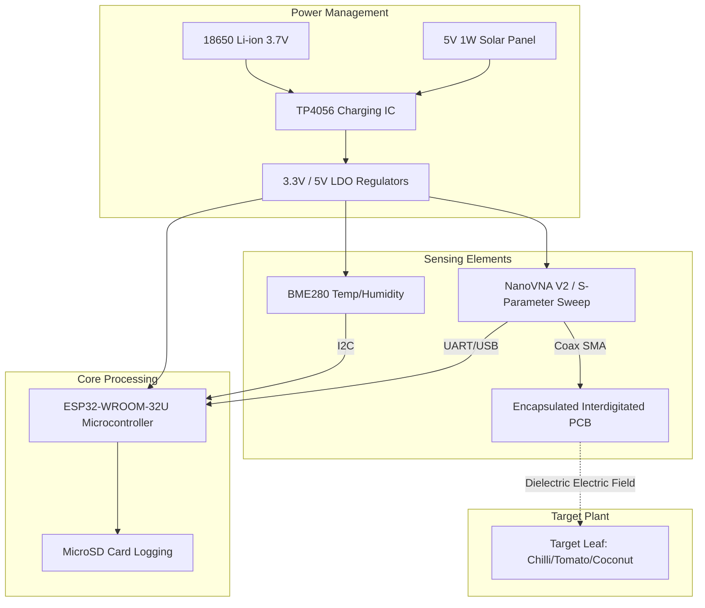

# Hardware Model (60% Development)

## 1. System Block Diagram

The following Mermaid diagram outlines the completed hardware schematic required for the cross-morphology capacitive leaf sensor.

## 2. Enclosure and Weatherproofing Implementation

- **PCB Design**: We have modeled standard interdigitated copper trace layouts using KiCad. The traces are 2mm wide with a 0.5mm gap, operating primarily in the fringing electric field regime.
- **Parylene-C Coating**: The copper acts as the conductive plate, the Parylene acts as a rigid series dielectric, and the leaf acts as the variable dielectric.
- **Mount**: The 3D model for the clamp (chilli/tomato) utilizes soft TPU material. The 60% completion represents the functional wiring diagram and ESP32 power-switching code (turning the VNA on via MOSFET to save battery).
